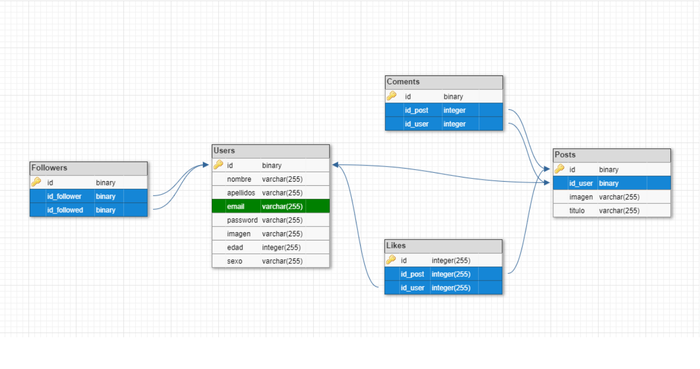

# ProyectoFinalAngular

Este proyecto ha sido desarrollado con Laravel.

Consiste en la gestion de una red social. Es recomendable vincularlo con el frontend del siguiente repositorio https://github.com/carlosalabau/red_social_Angular

## Comenzando

### Pre-Requisitos

Vas a necesitar un IDE como por ejemplo Visual Code Studio o PhpStorm.

Tambien necesitas un stack de sofware, como wamp, mamp, xamp para iniciar servicios como PHP y PHPmyadmin. Es necesario tenerlos inciados cuando arranques el proyecto.

### Instalacion

Para poder tener el proyecto funcionando en tu PC necesitas realizar lo siguiente:
  1. Dirigite a la carpeta y ejecuta el comando "composer global require laravel/installer". 
  2. Lo primero que tendras que hacer es crear la base de datos, se debe llamar redSocial.
  3. Ahora tendras que crear todas sus tablas, columnas y relaciones. Para ello ejecuta el comando "php artisan migrate"
  4. Para rellenar las tablas con datos aleatorios ejecuta el comando "php artisan db:seed".
  5. Una vez finalizado ejecuta el comando "php artisan serve". Esto iniciara el servidor en la ruta "localhost:8000"
  
 
### Estructura

El proyecto consta de 5 tablas: users, posts, likes, comments y followers. A continuacion podeis ver las tablas con sus columnas y relaciones.

Las relaciones son las siguientes:

users - posts: 1-N

users - (likes) - posts: N-N

posts - comments: 1-N

users - (followers) - users: N-N

## Autor

Carlos Alabau - Full Stack Developer

